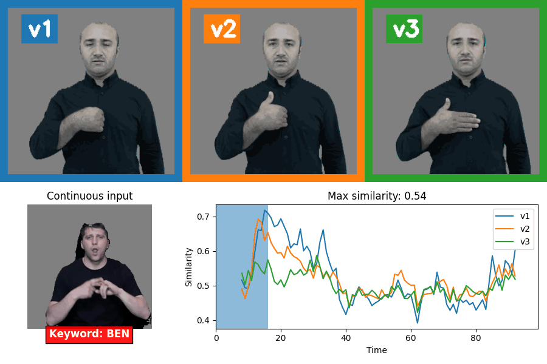
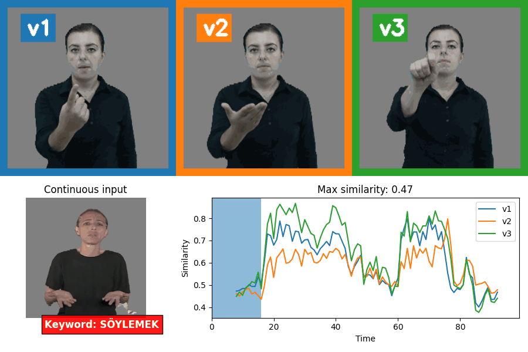
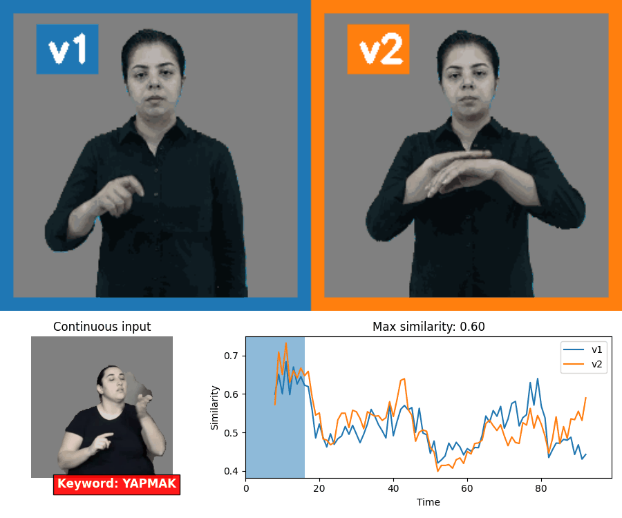

# spotter_tid

The repository for sign language spotting on BUTID dataset

## Examples





```bash
python demo.py \
    --input_path sample/1qiS6269JY4.gif \
    --keyword YAPMAK \
    --output_path outputs/YAPMAK_out.gif \
    --bsldict_metadata_path data/i3d/tid_sozluk.i3d.pth \
    --similarity_thres 0.7

```
